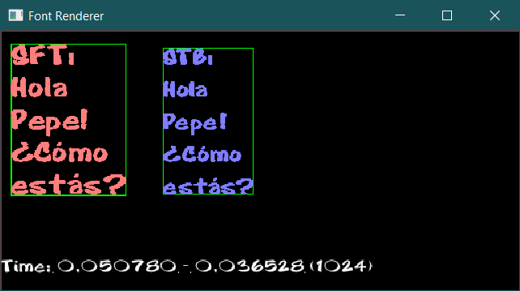
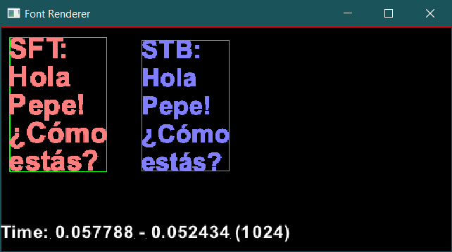

# FontRenderer

FontRenderer is a simple tool for rendering text from a ttf font into a buffer (with clipping).

As an example I have used the Mini Frame Buffer (MiniFB) library to create a window and render some text inside.

# API

The APi is simple:
```c
const char text = "Hello World!";
uint32_t   fontSize = 32;
uint32_t   color32 = 0xffff0000;

// Load a font
MindShake::FontSTB font("resources/Cartoon_Regular.ttf");

// Set the clipping (optional)
font.SetClipping(left, top, right, bottom);

// In case you need the dimensions of the future rendered text. For instance to horizontal align text...
Rect rect;
font.GetTextBox(text, fontSize, &rect);

// Draw a colored text of height fontSize in your buffer at pos (posX, posY)
font.DrawText(text, fontSize, color32, bufferDest, bufferDestStride, posX, posY);
```

# Font Renderer external dependencies

For getting the font glyphs the following libraries are used:
 * [stb_truetype](https://github.com/nothings/stb/blob/master/stb_truetype.h) (.ttf) :ok:
 * [libschrift](https://github.com/tomolt/libschrift) :ok: (.ttf, .otf)
 * [FreeType](https://freetype.org/) ❌ (not yet)

# How to use it

Select the library you want to use into your project (stb_truetype, libschrift,  ~~FreeType~~) and drop the following files in your project:

- Font.h
- Font.cpp
- SkylineBinPack.h
- SkylineBinPack.cpp
---
**If you choose to use libschrift**
- FontSFT.h
- FontSFT.cpp
- schrift.h
- schrift.c
---
**If you choose to use stb_truetype**
- FontSTB.h
- FontSTB.cpp
- stb_truetype.h

# Captures

|||