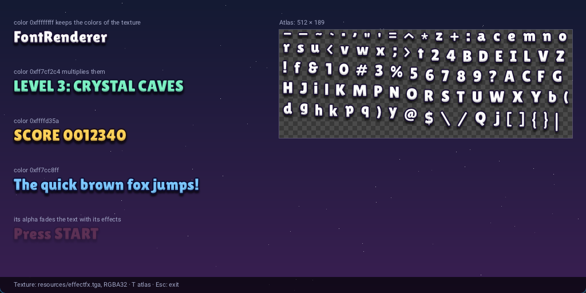
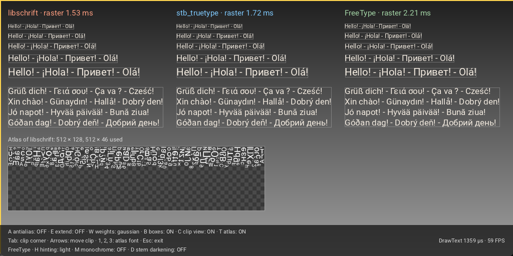
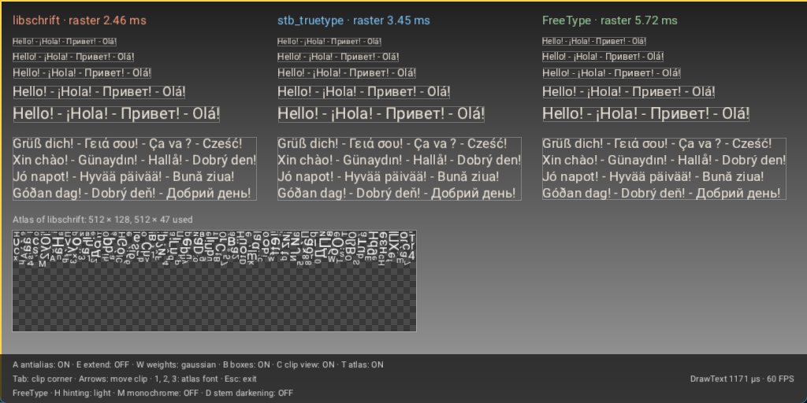
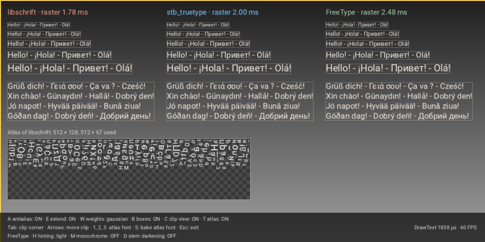
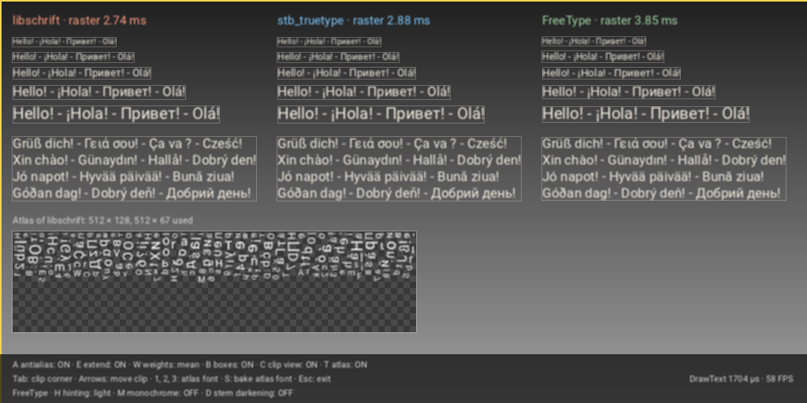
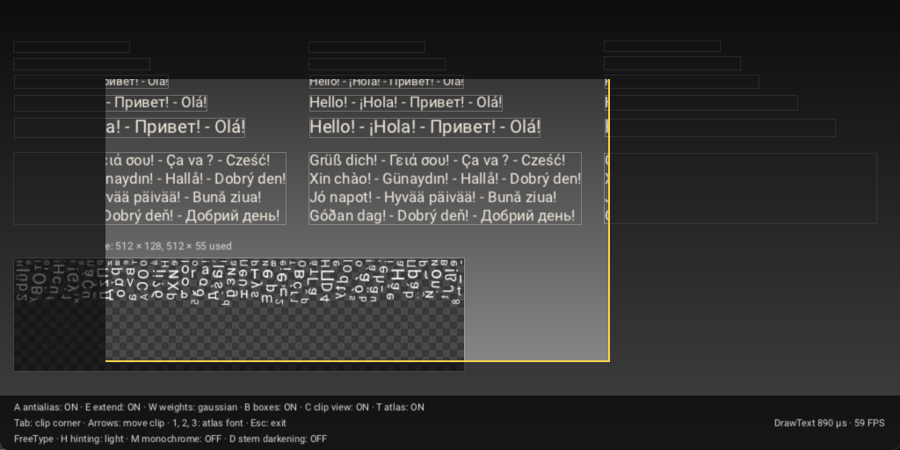
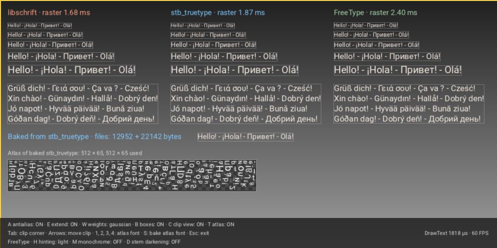

# FontRenderer

FontRenderer is a simple tool for rendering text from a ttf font into a buffer (with clipping).

It can also save the glyphs it renders and draw text with them later, without the font file and without a rasterizer (see [Baked fonts](#baked-fonts)), and it gives where each glyph goes, to draw the text with the GPU (see [Drawing with the GPU](#drawing-with-the-gpu)).

As an example I have used the Mini Frame Buffer (MiniFB) library to create a window and render some text inside.

## API

The API is simple:

```cpp
const char *text = "Hello World!";
uint32_t   fontSize = 32;
uint32_t   color32 = 0xffff0000;   // ARGB. With alpha 0 the text is invisible

// Load a font
MindShake::FontSTB font("resources/Roboto-Regular.ttf");

// Set the clipping (optional, but without it the user has the responsibility to fit the text inside the buffer)
font.SetClipping(left, top, right, bottom);

// Enable antialias
font.SetAntialias(true);
font.SetAntialiasWeights(20, 4, 1); // Gaussian
font.SetAntialiasWeights(1, 1, 1);  // Mean

// Allow antialias to extend one border pixel per glyph
font.SetAntialiasAllowEx(true);

// Empty pixels between the glyphs in the texture, so that bilinear filtering does not mix neighbouring glyphs (1 by default)
font.SetGlyphSpacing(1);

// In case you need the dimensions of the future rendered text. For instance to horizontal align text...
MindShake::FontBase::Rect rect;
font.GetTextBox(text, fontSize, &rect);

// Draw a colored text of height fontSize in your buffer at pos (posX, posY)
font.DrawText(text, fontSize, color32, bufferDest, bufferDestStride, posX, posY);
```

**Note**: Each glyph is rendered only once per fontSize, so changing any antialias setting, the glyph spacing or the glyph padding discards the glyphs already rendered.

**Note**: By default the packer can rotate a glyph to fit more glyphs in the texture. With the SSE2 and NEON code, a rotated glyph usually draws more slowly: between 6 and 30 % slower in our benchmarks, on x86 with GCC and MSVC, an Apple M1, a Cortex-A78 and a Cortex-A55. There are exceptions: on x86, glyphs of 96 pixels drew faster rotated, and so did glyphs of 24 and 40 pixels on the Cortex-A55. The scalar code draws both at the same speed. If drawing speed matters more than texture space, call `SetAllowRotation(false)` before rendering the glyphs.

**Note**: `DrawText` also blends the alpha of the buffer, as the *over* operator of Porter and Duff does. An opaque buffer stays opaque. On a transparent buffer, the result has premultiplied alpha: blue, green and red are multiplied by the alpha. A buffer that already has translucent pixels must have premultiplied alpha too. The color of the text is not premultiplied.

### Classes

- `FontBase` lays out and draws text with the glyphs a font already has. `DrawText`, `GetTextBox` and `GetGlyphQuads` are here.
- `Font` renders its glyphs from a font file the first time they are drawn. `FontSTB`, `FontSFT` and `FontFT` are its backends.
- `FontBaked` only reads the glyphs that a `Font` saved before. See [Baked fonts](#baked-fonts).

## Baked fonts

A `Font` can save the glyphs it has rendered, and `FontBaked` can draw text with them later, without the font file and without a rasterizer. This is useful on computers that are too slow to rasterize glyphs, like DOS computers, or to ship a program without the font and its rasterizer.

`FontBaked` cannot render new glyphs. It does not draw a code point or a height that was not saved.

```cpp
MindShake::FontSTB font("resources/Roboto-Regular.ttf");
font.SetAntialias(true);

// Render every glyph the program will draw, at every height it will use.
font.Preload(u8"ABCDEFGHIJKLMNOPQRSTUVWXYZabcdefghijklmnopqrstuvwxyz0123456789 .,:;!?¿¡áéíóúñÑ", 16);
font.Preload(u8"0123456789", 32);

// Look up the kerning of every pair of rendered glyphs. It can be very slow with many glyphs.
font.LoadAllKerningPairs();

font.SaveBaked("roboto.frb", "roboto.tga");
```

And later, maybe in another program:

```cpp
MindShake::FontBaked font("roboto.frb", "roboto.tga");
font.DrawText("Hello", 16, color32, bufferDest, bufferDestStride, posX, posY);
```

`Preload` packs all the glyphs of the text together, which fills the texture better than drawing them one by one. `SaveBaked` saves every glyph rendered so far, also the ones rendered by `DrawText` or `GetTextBox`. It only saves the kerning pairs already looked up, so call `LoadAllKerningPairs` first.

`SaveBaked` writes two files:

- The metrics file has the metrics of each height, the position of each glyph in the texture, and the kerning. It is a little-endian binary file, so it works the same on every platform.
- The texture is an 8-bit grayscale TGA compressed with RLE, which most image programs read. It only has the used area of the texture. `FontBaked` reads it compressed or not, with its rows from the top down or from the bottom up. It also reads a TGA with alpha, see [Adding effects to the texture](#adding-effects-to-the-texture).

You can convert the texture to another format, like PNG, and decode it yourself. Then pass the pixels to `FontBaked(metricsFile, texture, width, height, format)`, with `ETextureFormat::Alpha8` for one byte per texel, or `ETextureFormat::BGRA32` for four: blue, green, red and alpha. Use `ETextureFormat::BGRA32Premultiplied` instead if blue, green and red are already multiplied by the alpha. The size must be the same. If the texture is only in the GPU, pass `nullptr`: `DrawText` then draws nothing, but `GetGlyphQuads` still works.

### Adding effects to the texture

You can add effects to the saved texture with an image program, like a shadow, an outline or a gradient, and `FontBaked` draws them:

1. Before rendering the glyphs, leave room for the effects with `SetGlyphPadding(left, top, right, bottom)`. These empty pixels are part of each glyph, so `DrawText`, `GetTextBox` and `GetGlyphQuads` include them. For example, a shadow 3 pixels to the right and 3 pixels down needs `SetGlyphPadding(0, 0, 3, 3)`.
2. If an effect is not symmetric about the diagonal, like a vertical gradient or a shadow that goes further right than down, call `SetAllowRotation(false)` too. The packer can rotate a glyph to fit it better, and it stores a rotated glyph transposed, so such an effect would look wrong on it.
3. Save the font with `SaveBaked`, add the effects to the texture, with an image program or with a script like the one in [the effects example](#the-effects-example), and save it as a 32-bit TGA with alpha, compressed or not. The alpha must cover the text and its effects. Some programs save the alpha of a TGA from a separate alpha channel, not from the transparency of the layer, so check which one yours uses.

`FontBaked` reads the 32-bit TGA as a color texture. It also reads a 16-bit grayscale TGA with alpha, as a color texture with the gray in blue, green and red. It keeps a color texture with premultiplied alpha, so `GetTextureFormat` gives `BGRA32Premultiplied`: it multiplies blue, green and red by the alpha when it reads the texture. A TGA whose TGA 2.0 extension area says that the alpha is already premultiplied is kept as it is. `WriteTga` writes that extension area when you save a premultiplied texture with `ETgaAlpha::Premultiplied`.

A TGA can say that it has no alpha. Some programs write an alpha without saying it, so `FontBaked` still uses the alpha if it changes from pixel to pixel. If it is the same in every pixel, there is no text in it, and `FontBaked` gives `EStatus::InvalidTexture`. It gives the same status for a color TGA with 24 bits, and for a texture whose size is not the one in the metrics file.

`DrawText` multiplies the color of each texel by the color of the text, as a GPU does with the color of a vertex. So white text keeps the colors of the texture, and a white glyph with a black outline, drawn in red, is red with a black outline.

```cpp
MindShake::FontSTB font("resources/Roboto-Regular.ttf");
font.SetGlyphPadding(2, 2, 5, 5);
font.SetAllowRotation(false);
font.Preload(u8"ABCDEFGHIJKLMNOPQRSTUVWXYZabcdefghijklmnopqrstuvwxyz0123456789 .,:;!?", 32);
font.LoadAllKerningPairs();
font.SaveBaked("roboto.frb", "roboto.tga");

// Later, after adding the effects to roboto.tga and saving it with 32 bits:
MindShake::FontBaked baked("roboto.frb", "roboto.tga");
baked.DrawText("Hello", 32, 0xffffffff, bufferDest, bufferDestStride, posX, posY);
```

The glyph spacing, set with `SetGlyphSpacing`, is a different thing: the empty pixels between the glyphs in the texture, so that bilinear filtering does not mix neighbouring glyphs. It is not part of any glyph, so an effect must not use it.

### The effects example

Two programs and a script show the whole process, with the font [Lilita One](https://fonts.google.com/specimen/Lilita+One):

1. `exampleBakeEffects` bakes the printable ASCII characters at 32 pixels, with a glyph padding of (6, 4, 6, 10) and without rotation. It saves `resources/effects.frb` and `resources/effects.tga`, the texture in grayscale.
2. [tools/add_effects.py](tools/add_effects.py) adds a 2 pixel dark outline, a shadow 4 pixels down and a bevel lit from above, and saves `resources/effectfx.tga`. The glyphs stay white, so the color of the text tints them while the outline stays dark. It needs Python with numpy and Pillow, and its settings are at the top of the file. An image program can do the same.
3. `exampleEffects` draws with `FontBaked` and that texture: once in white, which keeps the colors of the texture, and then in other colors, one of them fading with its alpha.



The repository already has the files of the three steps, so `exampleEffects` works without running the others. If you bake the font again, run the script again too: the texture with the effects must come from the same bake as the metrics file.

## Drawing with the GPU

`GetGlyphQuads` gives the glyphs that `DrawText` would draw: where each one goes, relative to the position of the text, and the area of the texture it uses. Draw a textured quad for each one. The clipping does not apply to the quads.

The packer can rotate a glyph to fit it better, unless you call `SetAllowRotation(false)`. A rotated glyph is stored transposed: the pixel (x, y) of the quad is the texel (textureRect.x + y, textureRect.y + x).

`GetTextureFormat` says how to upload the texture. A `Font` always has an `Alpha8` texture, with one byte of coverage per texel. A `FontBaked` with a color texture has a `BGRA32Premultiplied` texture: the bytes blue, green, red and alpha, with blue, green and red multiplied by the alpha. Draw it with the blend of premultiplied alpha, `glBlendFunc(GL_ONE, GL_ONE_MINUS_SRC_ALPHA)` in OpenGL or `D3D11_BLEND_ONE` and `D3D11_BLEND_INV_SRC_ALPHA` in Direct3D, and premultiply the color of the vertices too. Premultiplied alpha also filters correctly: bilinear filtering and mipmaps do not darken the edges of the effects. The byte order is the order of the TGA file and of the 32-bit window buffers of Windows, macOS and Linux, so `DrawText` does not reorder the channels. Upload it with `GL_BGRA` and `GL_UNSIGNED_BYTE` in OpenGL, or as `DXGI_FORMAT_B8G8R8A8_UNORM` in Direct3D. OpenGL ES and WebGL only accept `GL_BGRA` with an extension: upload the bytes as `GL_RGBA`, and swap red and blue in the shader with `.bgra`, which costs nothing.

With `Font`, drawing or measuring text can render new glyphs and change the texture. `GetTextureVersion` changes every time the texels change, so compare it with the version you uploaded to know when to upload the texture again.

## Font Renderer external dependencies

For getting the font glyphs the following libraries are used:

- [stb_truetype](https://github.com/nothings/stb/blob/master/stb_truetype.h) (.ttf, .otf) :ok:
- [libschrift](https://github.com/tomolt/libschrift) (.ttf, and .otf with TrueType outlines: it cannot read CFF outlines) :ok:
- [FreeType](https://freetype.org/) (.ttf, .otf, and the other scalable formats it reads) :ok: (optional). `FontFT` also has hinting, a monochrome mode and stem darkening, which make small text sharper. See `FontFT.h`.

`FontBaked` does not need any of them: it only reads the files that a `Font` saved.

**Note**: The copy of libschrift in `src/external/libschrift` is version 0.10.2 with some changes. FontSFT needs them, so use this copy and not the upstream one:

- `sft_unitsPerEm()` returns the units per em of the font.
- `SFT_GMetrics::xOffset` gives the horizontal position of the image that `sft_render` produces. It can differ from the left side bearing.
- Extra bounds checks for the pairs of the `kern` table and for the groups of the format 12 and 13 `cmap` subtables.
- The rasterizer keeps its cells on the heap. Upstream reserves 256 KB of stack for them on every glyph, which overflows the default 64 KB stack of Emscripten.
- It builds with DJGPP (DOS). `getu32` has the same return type in its declaration and in its definition, and `sft_loadfile` always fails because DOS cannot map files. FontSFT uses `sft_loadmem`, so this does not affect it.

## Kerning

Every backend reads the kerning of pairs of glyphs from the `kern` feature of the OpenType `GPOS` table with `GposKerning`. stb_truetype only reads part of `GPOS`, and libschrift does not read it. `GposKerning` reads pair adjustments in both formats and with any value format, also inside extension lookups, in `GPOS` 1.0 and 1.1. As in HarfBuzz, a font without that kerning uses its `kern` table instead.

FontRenderer does not know the script of the text, and a font can kern the same pair differently in each script. `GposKerning` uses the first script whose kerning has the pair: Latin, then the default script, then the rest in the order of the font.

Kerning that depends on more than two glyphs needs a text shaper like HarfBuzz, so FontRenderer does not apply it.

## Platforms

Tested on Windows, Linux, the web (Emscripten) and DOS (DJGPP, in DOSBox-X). It also builds for Android. macOS and iOS use the same POSIX code, but they are not tested.

DOS support is minimal. DOS cannot map files, so the whole font is loaded into memory, and rasterizing TrueType glyphs is slow on computers of that time. On DOS, a [baked font](#baked-fonts) is a better choice: build only `FONTRENDERER_USE_BAKED`, and save the font on another computer. The example also needs long file names (`lfn = true` in DOSBox-X) to find its font file.

## How to use it

You have two options:

- Use CMake. Add FontRenderer with `add_subdirectory()` or `FetchContent`, and link against the `FontRenderer::FontRenderer` target.
  These options choose what is built:

  |Option|Default|What it builds|
  |---|---|---|
  |`FONTRENDERER_USE_STB`|`ON`|The stb_truetype backend, `FontSTB`|
  |`FONTRENDERER_USE_LIBSCHRIFT`|`ON`|The libschrift backend, `FontSFT`|
  |`FONTRENDERER_USE_FREETYPE`|`OFF`|The FreeType backend, `FontFT`. CMake uses the FreeType installed in the system, and downloads it if there is none|
  |`FONTRENDERER_USE_BAKED`|`ON`|The backend that reads baked fonts, `FontBaked`|
  |`FONTRENDERER_DISABLE_SIMD`|`OFF`|Only the scalar drawing code. By default the text is drawn with SSE2 where the compiler may use it, always on x86 of 64 bits, and with NEON on ARM64|
  |`FONTRENDERER_BUILD_EXAMPLES`|`ON` only when FontRenderer is the main project|The examples, which show every backend that is on. The [effects example](#the-effects-example) also needs `FONTRENDERER_USE_BAKED`. They download MiniFB, unless the project that adds FontRenderer already has a `minifb` target|
  |`FONTRENDERER_BUILD_TESTS`|`ON` only when FontRenderer is the main project|The unit tests|

  At least one backend must be on. The library defines `FONTRENDERER_USE_STB`, `FONTRENDERER_USE_LIBSCHRIFT`, `FONTRENDERER_USE_FREETYPE` and `FONTRENDERER_USE_BAKED` for each backend that is on, also for the code that uses the library. The header of each backend, like `FontSTB.h`, stops the build if its macro is not defined.

  With only `FONTRENDERER_USE_BAKED`, the library does not build `Font`, which renders glyphs. The examples are not built, and the unit tests only test what does not need a font file.

- Select the library you want to use into your project (stb_truetype, libschrift, FreeType) and drop the following files in your project.
  Define the macro of each backend you choose, `FONTRENDERER_USE_STB`, `FONTRENDERER_USE_LIBSCHRIFT`, `FONTRENDERER_USE_FREETYPE` or `FONTRENDERER_USE_BAKED`, for every file you compile: the header of the backend and the C API need it.

  - FontBase.h
  - FontBase.cpp
  - GlyphDraw.h
  - GlyphDraw.cpp
  - GlyphDrawNeon.cpp
  - GlyphDrawSse2.cpp
  - MappedFile.h
  - MappedFile.cpp
  - Platform.h
  - SkylineBinPack.h
  - Tga.h
  - Tga.cpp
  - UTF8_Utils.h

  ---

  **If you choose libschrift, stb_truetype or FreeType**, which render glyphs, also:

  - Font.h
  - Font.cpp
  - GposKerning.h
  - GposKerning.cpp
  - SkylineBinPack.cpp

  ---

  **If you choose to use libschrift**:

  - FontSFT.h
  - FontSFT.cpp
  - schrift.h (the modified copy, see above)
  - schrift.c (the modified copy, see above)

  ---

  **If you choose to use stb_truetype**:

  - FontSTB.h
  - FontSTB.cpp
  - stb_truetype.h

  ---

  **If you choose to use FreeType**:

  - FontFT.h
  - FontFT.cpp
  - FreeType itself, which you build and link on your own

  ---

  **If you choose to use baked fonts**:

  - FontBaked.h
  - FontBaked.cpp

  ---

  **If you also want the C API**:

  - FontC.h
  - FontC.cpp, which only creates fonts with the backends whose macro is defined

## Licenses

FontRenderer is distributed under the Boost Software License 1.0, see [LICENSE](LICENSE).

The licenses of the third party code and fonts in this repository are in [LICENSES](LICENSES): stb_truetype, libschrift, pixman, doctest, and the Roboto, DejaVu and Lilita One fonts used by the examples and the tests. The textures in `bin/resources` are baked from Lilita One.

CMake downloads MiniFB for the examples, and FreeType when `FONTRENDERER_USE_FREETYPE` is on and the system has none. They are not part of this repository and have their own licenses. If your program uses the FreeType backend, it includes FreeType, whose license (the FreeType License or the GPLv2, as you choose) asks you to credit FreeType in your documentation.

## Captures

The example shows every backend that is on side by side, the atlas of one of them, and the keys in the status bar. S bakes the font of the shown atlas: it saves `baked.frb` and `baked.tga` next to the example, reads them back with `FontBaked`, and draws a row with it. The baked row keeps the settings it was saved with, so the antialias keys do not change it.

|Capture|Settings|
|---|---|
||No antialias|
||Antialias with Gaussian weights|
||Antialias with Gaussian weights, glyphs extended one pixel|
||Antialias with mean weights, glyphs extended one pixel|
||Clipping (the darkened area) and the atlas of stb_truetype|
||The font of stb_truetype baked with S: its row, drawn with `FontBaked`, and its atlas|
